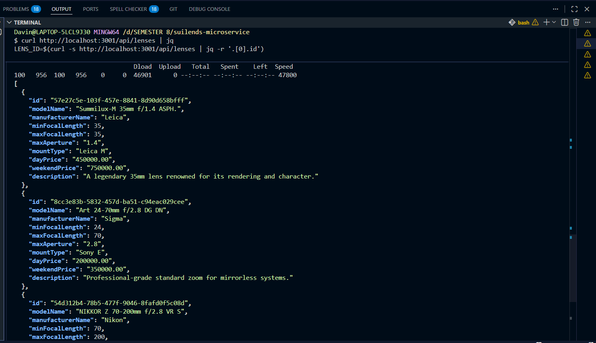
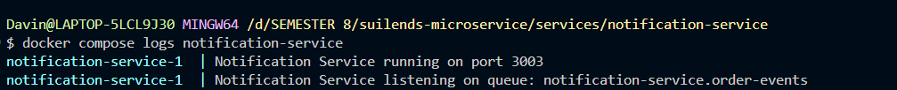
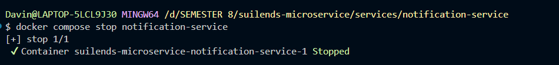
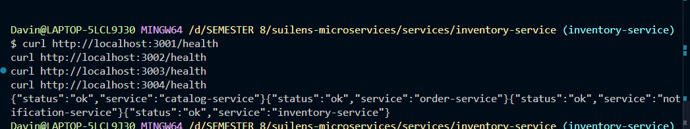

Rakha Davin Bani Alamsyah

13. Mengapa Order Service tidak bisa langsung query tabel lenses dalam versi mikroservis?
Karena pada mikroservis, setiap service memiliki database sendiri (database per service) dan tidak boleh mengakses data service lain. Dalam kasus ini, jika Order Service langsung mengakses tabel lenses menggunakan query, akan timbul masalah sehingga terjadi tight coupling: skema Catalog jadi dependency Order, deployment/rollback jadi saling mengintervensi/menggangu, dan batas kepemilikan data hilang. Secara prinsip, Order hanya boleh tahu data Catalog lewat API/kontrak (sinkron) atau event/data replication (asinkron).

14.Apa yang terjadi pada event di RabbitMQ jika tidak ada consumer yang berjalan? Apa yang terjadi ketika consumer mulai berjalan lagi?
Jika message dipublish ke queue yang durable dan message-nya persistent, maka message akan menumpuk di queue meskipun consumer mati. Saat consumer hidup kembali, hal ini akan mengonsumsi backlog satu per satu sesuai prefetch/ack.

Jik queue tidak durable atau message tidak persistent, message bisa hilang saat broker restart. Kalau message dipublish ke exchange tapi tidak ada queue yang bind (atau routing key tidak match), message bisa drop (kecuali pakai mandatory/alternate exchange / dead-letter setup).

15.Mengapa kita menyimpan lensSnapshot di record pesanan alih-alih memanggil Catalog Service setiap kali membutuhkan detail lensa?
Karena order butuh rekam jejak historis “lensa apa yang dipesan saat itu” (nama, harga, dsb). Kalau selalu call Catalog, detail bisa berubah (harga/nama/update stok), jadi order lama bisa tampil salah. Snapshot juga bikin sistem lebih resilient: kalau Catalog down, Order masih bisa menampilkan detail dasar pesanan tanpa bergantung runtime ke Catalog.

16.Dalam monolit, pembuatan pesanan + notifikasi adalah satu transaksi atomik. Dalam mikroservis, tidak demikian. Apa yang bisa salah?
Banyak hal:

- Order sukses tersimpan, tapi publish event notifikasi gagal → pesanan ada, notifikasi tidak terkirim.

- Event terkirim, tapi notifikasi gagal diproses → perlu retry/DLQ.

- Event dipublish dua kali atau consumer retry → notifikasi dobel (butuh idempotency/dedup).

- Konsistensi jadi eventual consistency: user mungkin lihat order dibuat terlebih dahulu, kemudian notifikasi akan menyusul.
Kemudian solusi umum yang bisa dilakukan seperti, outbox pattern, retry + DLQ, idempotency key, saga/compensation.

17.Mengapa pemanggilan Katalog → Pesanan sinkron tetapi Pesanan → Notifikasi asinkron? Bisakah sebaliknya?
Order perlu jawaban langsung saat membuat pesanan, diantaranya validasi lensId, ambil detail untuk snapshot, cek aturan bisnis. Itu cocok sinkron (HTTP) karena request/response dibutuhkan “sekarang”.

Notifikasi bukan bagian kritis untuk “order tercipta”; itu side effect yang boleh tertunda dan sebaiknya tidak membuat create order gagal. Makanya cocok asinkron (RabbitMQ) untuk decouple, retry, dan tahan lonjakan.

Bisa sebaliknya, tapi ada trade-off:

Katalog→Pesanan asinkron: create order jadi tidak bisa langsung validasi/detail lensa; perlu desain lain (mis. Catalog publish “LensUpdated” dan Order simpan cache lokal), atau order masuk status “pending” sampai data datang.

Pesanan→Notifikasi sinkron: user bisa kena latency tinggi atau gagal order hanya karena service notifikasi down—biasanya tidak diinginkan.

